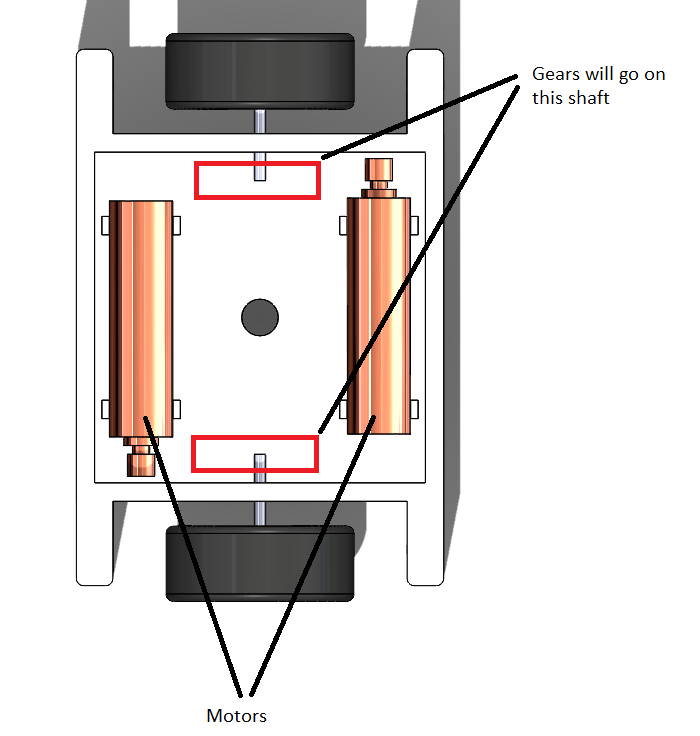

# ME 405 Term Project
## Tyler McCue and Clayton Elwell Term Project

### Project Description
Our robot will resemble that of an RC car, but with only two wheels instead of
4. The device will be stabilized by four other legs that simply glide across the
surface as the robot moves. The pen will be mounted in the center of the two
wheels, allowing for easy control of the pen location. The pen itself will be
controlled by a solenoid which will lift the pen when not drawing and drop the pen
when it is. The chassis of the plotter will be 3D printed out of ABS or PLA with
heat-set inserts used for mounting the various components.
The robot will be powered by 8 AA batteries to produce a total of 24 V which
will power the solenoid and both motors. A buck converter will also be used to
step down the voltage in order to also power the STM as well. The STM will also be
accompanied by a bluetooth module allowing for remote communication to the
plotter since the whole device will be moving.

### Bill of Materials

| Qty. | Part                  | Source                | Est. Cost |
|:----:|:----------------------|:----------------------|:---------:|
|  2   | Pittperson Gearmotors | ME405 Tub             |     -     |
|  1   | Nucleo with Shoe      | ME405 Tub             |     -     |
|  1   | Purple Sharpie&trade; | Rite Aid&trade;       |   $3.00   |
|  2   | Motor Driver/Shield   | ME405 Tub             |     -     |
|  1   | ABS/PLA Filament Roll | Tyler's Closet        |     -     |
|  2   | Wheels                | Amazon                |  $11.00   |
|  2   | Wheel axel            | Amazon                |   $9.00   |
|  2   | Gears                 | Amazon                |   $7.50   |
|  1   | Solenoid Actuator     | Amazon                |  $10.50   |
|  1   | Battery (8-pack)      | Amazon                |   $5.40   |
|  2   | 694ZZ Bearings        | Amazon                |  $10.00   |
|  1   | Battery Housing       | Amazon                |   $8.00   |
|  1   | Bluetooth Module      | Amazon                |     ?     |

### CAD Images

 
Figure 1. Isometric view of system.

 
Figure 2. Internal motor layout.