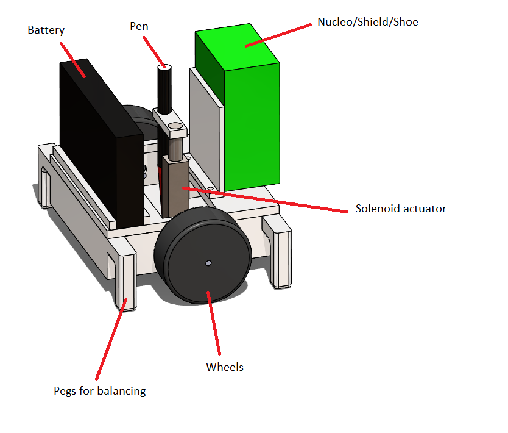
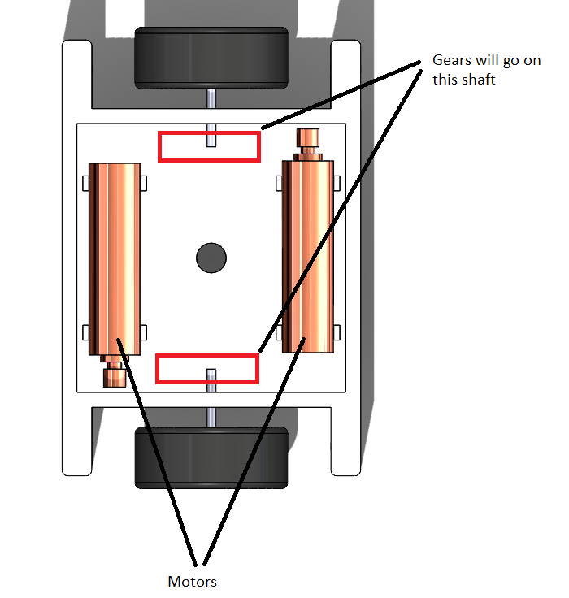

# ME 405 Term Project
## Tyler McCue and Clayton Elwell Term Project

### Project Description
TYLER FILL THIS SUCKA OUT!!!!

### Bill of Materials

| Qty. | Part                  | Source                | Est. Cost |
|:----:|:----------------------|:----------------------|:---------:|
|  2   | Pittperson Gearmotors | ME405 Tub             |     -     |
|  1   | Nucleo with Shoe      | ME405 Tub             |     -     |
|  1   | Purple Sharpie&trade; | Rite Aid&trade;       |   $3.00   |
|  2   | Motor Driver/Shield   | ME405 Tub             |     -     |
|  1   | ABS/PLA Filament Roll | Tyler's Closet        |     -     |
|  2   | Wheels                | Amazon                |  $11.00   |
|  2   | Wheel axel            | Amazon                |   $9.00   |
|  2   | Gears                 | Amazon                |   $7.50   |
|  1   | Solenoid Actuator     | Amazon                |  $10.50   |
|  1   | Battery (8-pack)      | Amazon                |   $5.40   |
|  2   | 694ZZ Bearings        | Amazon                |  $10.00   |
|  1   | Battery Housing       | Amazon                |   $8.00   |
|  1   | Bluetooth Module      | Amazon                |     ?     |

### CAD Images

 
Figure 1. Isometric view of system.

 
Figure 2. Internal motor layout.