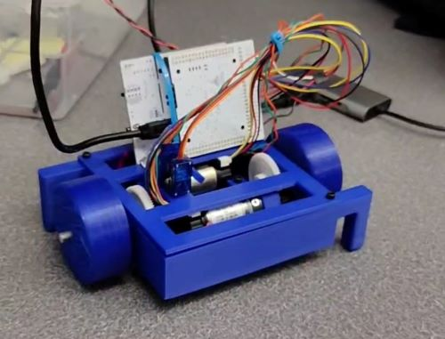
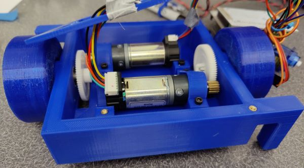
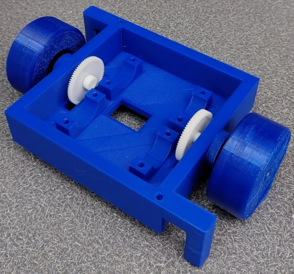
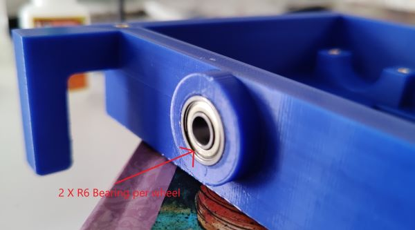
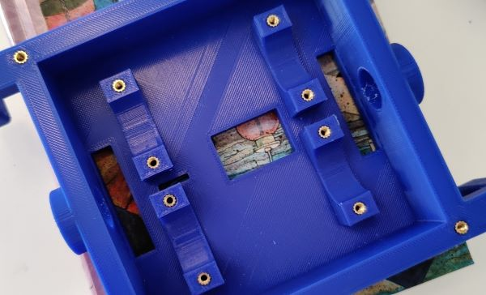
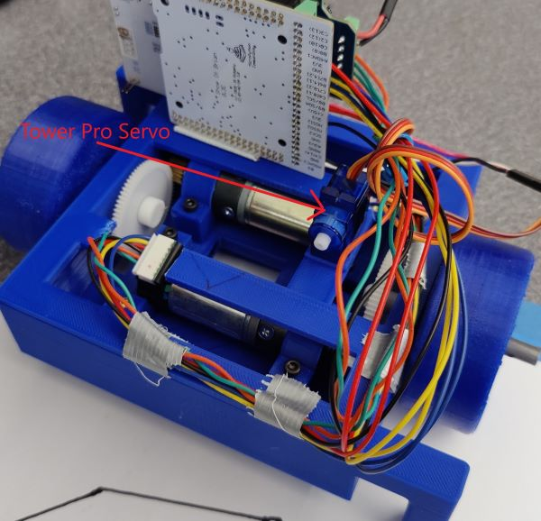
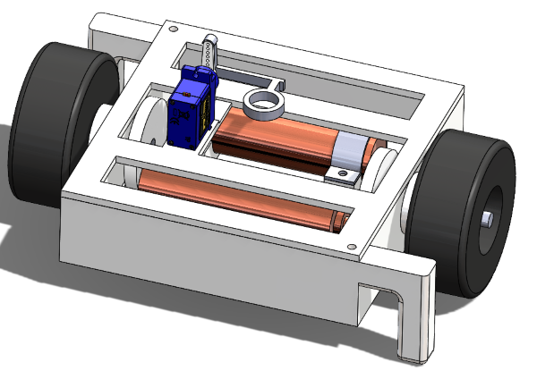

# ME 405 Term Project
## Tyler McCue and Clayton Elwell Term Project

### Introduction
The purpose of this device is to draw a 2D image that may be determined by the user, or an appropriate 
.hpgl interpreter. The device was not designed for a particular use case, rather as a novel mechatronic 
system that can perform the desired task. Design constraints for this project included the project budget 
and system complexity. 

### Hardware
To address the small project budget, we sourced most of our hardware components from the various scrap piles 
around the mechatronics lab. The large system components such as the wheel and chassis were 3D printed so that 
we may iterate rapidly if need be. The only purchased components for this project are the bearings that 
facilitate the wheels’ motion.

The system relies on two Pittman motors to actuate corresponding wheels that are linked via a simple gear train, 
as seen in Figure 1. The wheels are 3D printed from TPU to increase friction and improve positional accuracy; 
the chassis is fabricated from PLA. The two pegs on either side of the chassis help the car balance and prevent 
the need for any software to balance the wheels with the motor torques (Figure 2). Two bearings facilitate each wheel’s 
rotation, and the driveshafts are cut from 0.25” steel rod stock that was found in the mechatronics lab (Figure 3). 

 
Figure 1. Torque transmission system.

 
Figure 2. Chassis and wheels.

 
Figure 3. Press-fit bearings (with superglue).

To connect the motors to the chassis, M3 heat-set inserts and machine screws were used with PLA “straps” as 
seen in Figure 1 (PLA straps) and 4 (heat-set inserts). 

 
Figure 4. Chassis heat set inserts.

A Tower Pro servo motor is used control the drawing apparatus’s contact with the sketching surface; it is 
press fit into a thin PLA plate that fastens to the chassis with M3 heat-set inserts and machine screws (Figure 5).

 
Figure 5. Drawing apparatus servo motor.

The electronic hardware for this system includes the two ME 405 Pittman BLDC motors, a Tower Pro servo motor 
from any common Arduino starter kit, a Nucleo with the Shoe of Brian and motor driver/shoe, and a portable 
charger (optional). The portable charger replaced our original intent of using an RC battery, because the 
portable charger had a convenient 5V power output, and it was free. The harness was a rudimentary combination 
of strategically placed zip ties and duct tape strips.

### Software
The software takes a series of G-code-esque commands and converts those commands to a corresponding rotation 
for each wheel to rotate through. More specifically, the commands are a combination of degrees to rotate and 
inches to translate, with a Boolean input to indicate whether the pen should be “up” or “down”. 

We utilized a closed-loop proportional controller with feedback from the Pittman motor encoders to command the 
car to travel to the desired angle. Our firmware may be referenced in the "src" directory and documentation may
be found in the following link: https://celwell20.github.io/ME-405-Term-Project/

### Results
We tested our system by giving it various instructions to execute. First, we modeled a drawing in SOLIDWORKS to 
obtain accurate rotation and translation coordinates to create our drawing instructions. It should be noted that 
some sort of interpreter could be created to perform this task automatically; we decided that such a tool was 
outside the scope of this project. Once we had a set of instructions, we uploaded them to the Nucleo’s flash 
memory and prompted our system to execute the instructions. Figure 6 displays the desired drawing created in 
SOLIDWORKS; Figure 6 displays the drawing created by our system. Figure 8 links to a video demonstration of our 
plotter car.

 
Figure 6. Desired drawing.

 
Figure 7. Our system's drawing.

 
Figure 8. Demonstration video link.

### Discussion
We learned that a two-wheeled car is a decent approach to creating a plotter tool. Our system’s simplicity allowed 
us to dedicate equal time to the fabrication of the system and development of the controller and drawing 
instruction interpreter. Our selection of simple hardware components resulted in few hardware debugging issues 
and allowed us to conduct extensive testing throughout the system design process. 

Areas for possible improvement include creating an interpreter than can convert a SOLIDWORKS drawing file to a 
sequence of commands that our plotter car can subsequently execute. A more robust wire harness could also be 
developed if this system were to be designed with commercialization in mind. 

## Additional Contents and Files

### Bill of Materials

| Qty. | Part                  | Source                | Est. Cost |
|:----:|:----------------------|:----------------------|:---------:|
|  2   | Pittperson Gearmotors | ME405 Tub             |     -     |
|  1   | Nucleo with Shoe      | ME405 Tub             |     -     |
|  1   | Purple Sharpie&trade; | Rite Aid&trade;       |   $3.00   |
|  2   | Motor Driver/Shield   | ME405 Tub             |     -     |
|  1   | ABS/PLA Filament Roll | Tyler's Closet        |     -     |
|  2   | TPU Wheels            | Craig K's Closet      |     -     |
|  2   | Wheel axel            | Mechatronics Lab      |     -     |
|  2   | Gears                 | Mechatronics Lab      |     -     |
|  1   | Tower Pro Servo Motor | Tyler's Closet        |     -     |
|  1   | 5V Portable Charger   | Tyler's Closet        |     -     |
|  4   | R6 Bearings           | Amazon                |   $8.47   |
|  10  | M3 Heat Set Inserts   | Clayton's Closet      |     -     |
|  10  | M3 10 mm SCHS         | Clayton's Closet      |     -     |

### CAD Image

 
Figure 9. Isometric view of system.

### SOLIDWORKS Models and Assemblies
CAD models may be referenced in the “SOLIDWORKS Model” directory.